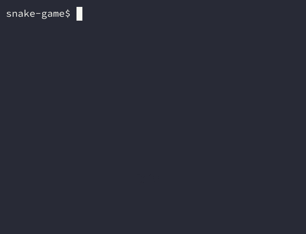

# Snake

[`snake`](https://github.com/printfer/snake-game), a free and open-source modern implementation of the beloved classic game. The project utilizes the ncurses library in C to provide a sleek terminal environment for an immersive and enjoyable gaming experience. Effortlessly control the snake with arrow keys or vim-like keys (h, j, k, l).



## Features

- Intuitive controls using arrow keys or vim-like keys (h, j, k, l)
- Random food generation for a more captivating and unpredictable gaming experience
- Random initial direction for the snake, adding variety to each game session
- Score tracking to challenge yourself and improve your skills
- Smooth and intuitive terminal UI for seamless control

## Getting Started

### Prerequisites

- GCC (GNU Compiler Collection)
- ncurses library

### Installing

To install the ncurses library on Ubuntu or Debian-based systems, run:

```bash
sudo apt-get install libncurses-dev
```

On Fedora, CentOS or RHEL-based systems, run:

```bash
sudo dnf install ncurses-devel
```

On Arch Linux or Arch-based systems, run:

```bash
sudo pacman -S ncurses
```

### Compiling and Running

To run the program directly, navigate to the project directory and execute the following command, which will handle the build process for you:

```bash
make run
```

Alternatively, you can manually compile the program first by running:

```bash
make
```

After compiling, the build directory will be located under `build`, and the binary under `bin`. You can then run the program using the following command:

```bash
./bin/snake
```

## Contributing

We welcome contributions from the community! If you'd like to contribute to the project, please follow these steps to set up the development environment:

- Install the necessary dependencies mentioned in the ["Installing"](#installing) section.
- Clone the repository and navigate to the project directory.
- Run the `./setup.sh` script to set up the development environment.

Once you have set up the development environment, you can start making changes to the codebase. After making your changes, be sure to test your updates by compiling and running the project as described in the ["Compiling and Running"](#compiling-and-running) section.

When you're ready to submit your changes, create a pull request, and we will review your contribution.

## Changelog

For the complete changelog, see the [CHANGELOG.md](CHANGELOG.md) file.

## License

[](https://www.gnu.org/licenses/gpl-3.0.html)

This project is licensed under the GPLv3 License. See the [LICENSE](LICENSE) file for more information.

## Credits

[`snake`](https://github.com/printfer/snake-game) has been designed and created by [Printfer](https://printfer.github.io/) with :heart:

Copyright © 2023 [Printfer](https://github.com/printfer)
